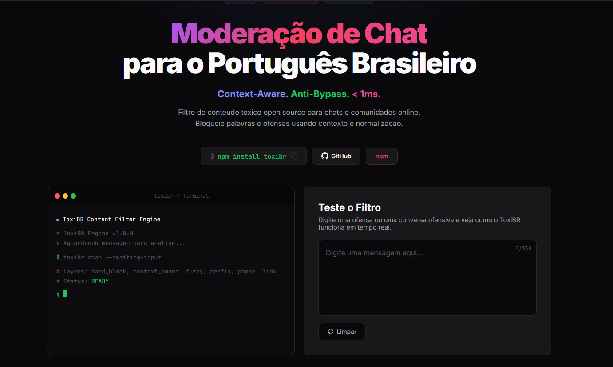

# ToxiBR - Moderacao de Chat Open Source



Biblioteca open source de moderacao de conteudo para portugues brasileiro. Filtra mensagens toxicas em tempo real, client-side, sem depender de API externa.

**Context-Aware. Anti-Bypass. < 1ms.**

## Por que usar?

- **Zero dependencias** — nada de SDK pesado, roda em qualquer lugar
- **Rapido** — menos de 1ms por mensagem
- **670+ termos** — slurs, sexual, violencia, racismo, nazismo, bullying
- **Anti-bypass** — normaliza leetspeak, homoglyphs, acentos, zero-width chars, abreviacoes BR, censura com `*`
- **Context-aware** — entende a diferenca entre "eu me sinto um lixo" e "voce e um lixo"
- **Proximity detection** — analisa proximidade entre palavras ofensivas e pronomes
- **Fuzzy matching** — Levenshtein pega typos intencionais (viadro, bucetra)
- **Prefix matching** — pega palavras truncadas (estup → estupro, punh → punheta)
- **Seed word density** — detecta conteudo sexual codificado (3+ palavras suspeitas juntas)
- **Modo censor** — substitui palavras toxicas por `***` em vez de bloquear
- **Open source** — qualquer um pode contribuir com novas palavras e melhorias

## Demo

Teste o filtro ao vivo: **[toxibr.vercel.app](https://toxibr.vercel.app)**

## Instalacao

```bash
npm install toxibr
```

## Uso rapido

```ts
import { filterContent } from 'toxibr';

const result = filterContent('mensagem aqui');

if (!result.allowed) {
  console.log(result.reason);  // 'hard_block' | 'directed_insult' | 'fuzzy_match' | 'suspicious_content' | ...
  console.log(result.matched); // palavra que matchou
}
```

## Modo censor

```ts
import { censorContent } from 'toxibr';

const result = censorContent('seu arrombado vai se fuder');
console.log(result.censored);  // "seu ********* vai se *****"
console.log(result.matches);   // [{ word: 'arrombado', reason: 'hard_block', ... }]
```

### Censurar phones e links inline

```ts
import { createCensor } from 'toxibr';

const censor = createCensor({
  censorPhones: true,   // "me liga 21994709426" → "me liga ***********"
  censorLinks: true,    // "veja www.site.com" → "veja ************"
  censorChar: '#',      // caractere customizado
});

const result = censor('me liga 21994709426 seu idiota');
// { censored: "me liga *********** seu ******", ... }
```

## Uso avancado

```ts
import { createFilter } from 'toxibr';

const filter = createFilter({
  extraBlockedWords: ['minha-palavra-custom'],
  extraContextWords: ['outra-palavra'],
  blockLinks: true,      // default: true
  blockPhones: true,     // default: true
  blockDigitsOnly: true, // default: true
  blockEmojis: true,     // default: true
});

const result = filter('mensagem aqui');
```

## Camadas de filtragem

| Camada | O que faz | Exemplo |
|--------|-----------|---------|
| **Censorship bypass** | Bloqueia `*` e `#` entre letras | `p*ta`, `v#ado` |
| **Pre-normalization** | Pega d4, Xcm, -18 antes do leetspeak | `20cm`, `d4`, `-18` |
| **Links** | URLs e dominios | `https://...`, `site.com` |
| **Telefone** | Numeros BR (5+ digitos) | `(21) 99470-9426` |
| **Emojis** | Emojis ofensivos e sequencias | `🖕`, `🍆💦`, `💦` |
| **Hard-block** | 670+ termos sempre proibidos | Slurs, sexual, violencia, nazismo |
| **Fuzzy match** | Levenshtein para typos | `viadro` → `viado` (dist 1) |
| **Prefix match** | Palavras truncadas | `estup` → `estupro` |
| **Context-aware** | Insulto dirigido vs auto-expressao | `"seu lixo"` vs `"me sinto um lixo"` |
| **Seed density** | 3+ palavras sexuais juntas | `"pau veiudo saco lotado leite"` |

## Normalizacao anti-bypass

Antes de checar a wordlist, o texto passa por 11 etapas de normalizacao:

| Tecnica | Antes | Depois |
|---------|-------|--------|
| Zero-width chars | `vi​ado` | `viado` |
| Homoglyphs cirilicos | `viаdо` | `viado` |
| Acentos | `viàdo` | `viado` |
| Chars repetidos | `viiaaado` | `viado` |
| Leetspeak | `3stupr0` | `estupro` |
| Censura | `p*ta`, `v#ado` | bloqueado |
| Pontos/tracos | `p.u.t.a` | `puta` |
| Espacos isolados | `p u t a` | `puta` |
| Abreviacoes BR | `ppk`, `krl` | `pepeca`, `caralho` |

## Context-aware: proximidade

O filtro usa **deteccao por proximidade** — analisa se o padrao dirigido (voce, seu, tu) esta perto da palavra ofensiva numa janela de 5 palavras:

```ts
// Auto-expressao — PERMITIDO
filterContent('eu me sinto um lixo');  // { allowed: true }

// Insulto dirigido — BLOQUEADO
filterContent('voce e um lixo');  // { allowed: false, reason: 'directed_insult' }

// Misto — bloqueia porque "voce" esta perto do segundo "lixo"
filterContent('me sinto um lixo e voce e um lixo tambem');  // { allowed: false }

// Misto — permite porque "voce" esta longe de "lixo"
filterContent('me sinto um lixo, queria que voce me respeitasse');  // { allowed: true }
```

## Exportacoes

```ts
import {
  filterContent,            // filtro default (zero config)
  createFilter,             // cria filtro customizado
  censorContent,            // censor default (zero config)
  createCensor,             // censor customizado
  normalize,                // normaliza texto (util para debug)
  HARD_BLOCKED,             // 670+ termos hard-blocked
  CONTEXT_SENSITIVE,        // termos context-sensitive
  SEXUAL_SEED_WORDS,        // palavras-semente sexuais
  DIRECTED_PATTERNS,        // regex de fala dirigida
  SELF_EXPRESSION_PATTERNS, // regex de auto-expressao
  ABBREVIATION_MAP,         // mapa de abreviacoes BR
} from 'toxibr';
```

## Contribuindo

Quer adicionar uma palavra ou melhorar o filtro? Leia o [CONTRIBUTING.md](CONTRIBUTING.md).

Encontrou um falso positivo ou uma palavra que deveria ser bloqueada? Use o formulario no site: **[toxibr.vercel.app](https://toxibr.vercel.app)**

```bash
npm test          # roda os testes
npm run validate  # verifica duplicatas nas wordlists
```

## Licenca

MIT
